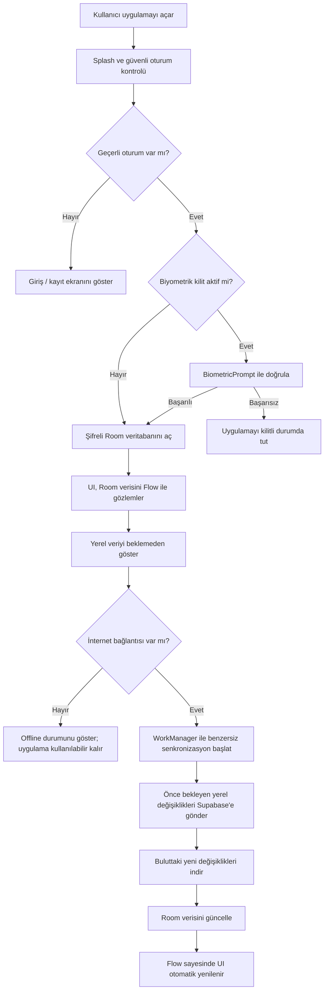
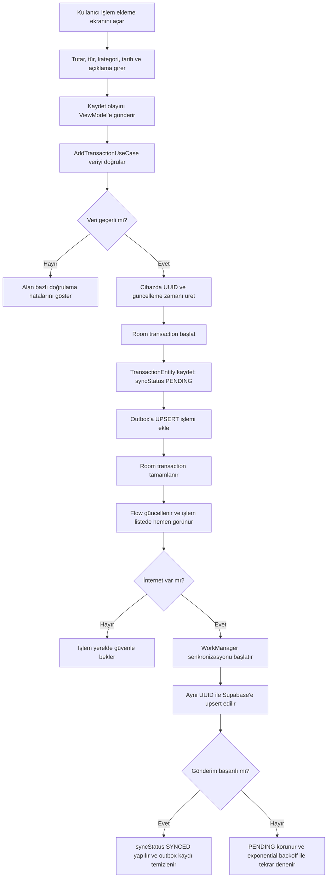
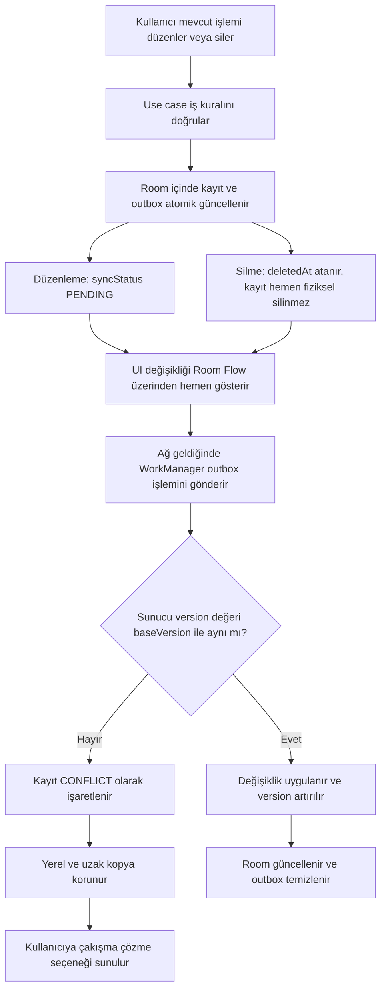

# Feniqo Web Referansı — Mobil Özellik ve Veri Envanteri

> Bu belge, mevcut React/Supabase uygulamasındaki özelliklerin FeniqoMobil projesine kontrollü şekilde aktarılması için hazırlanmıştır.

## Belge Durumu

- Web kaynak proje: `C:\Users\hp\Desktop\Feniqo`
- Mobil hedef proje: `C:\Users\hp\Desktop\FeniqoMobil`
- İnceleme durumu: Tamamlandı
- Son tamamlanan bölüm: 7. V1 Kapsamı
- Karar durumu: Uygulama sahibi tarafından 2026-08-03 tarihinde onaylandı

---

## 1. Ekran Envanteri
### Öncelik Açıklaması

- **V1:** İlk kullanılabilir ve yayınlanabilir çekirdek sürüm
- **V2:** Çekirdek veri ve senkronizasyon doğrulandıktan sonra
- **V3:** Gelişmiş analiz, yatırım ve premium özellikler

| ID | Web ekranı | Kaynak dosya | Temel kullanıcı amacı | Mobil karşılığı | Öncelik |
|---|---|---|---|---|---|
| SCR-01 | Giriş ve Kayıt | `Login.tsx` | Oturum açmak, hesap oluşturmak veya demo modunu kullanmak | Auth akışı | V1 |
| SCR-02 | Dashboard | `Dashboard.tsx` | Aylık gelir, gider, bakiye, tasarruf oranı ve MoneyScore görmek | Ana Sayfa | V1 |
| SCR-03 | İşlemler | `Transactions.tsx` | Gelir/gider eklemek, düzenlemek, silmek, aramak ve filtrelemek | İşlemler sekmesi | V1 |
| SCR-04 | Kategoriler | `Categories.tsx` | Gelir/gider kategorilerini yönetmek | Kategori yönetimi | V1 |
| SCR-05 | Çalışma Alanı | `Workspace.tsx` | Ortak alan oluşturmak, katılmak, üyeleri ve rolleri yönetmek | Ortak Alan ekranı | V2 |
| SCR-06 | Bütçeler | `Budgets.tsx` | Kategori bazlı aylık limit belirlemek ve kullanımı takip etmek | Bütçeler sekmesi | V2 |
| SCR-07 | Tekrarlayan İşlemler | `Recurring.tsx` | Düzenli gelir ve gider kuralları oluşturmak | Düzenli İşlemler ekranı | V2 |
| SCR-08 | Abonelikler | `Subscriptions.tsx` | Yenileme tarihlerini ve abonelik ödemelerini takip etmek | Abonelikler ekranı | V2 |
| SCR-09 | Hedefler | `Goals.tsx` | Birikim hedefi oluşturmak ve hedefe para eklemek | Hedefler ekranı | V2 |
| SCR-10 | Borçlar | `Debts.tsx` | Borç/alacak kaydetmek ve ödeme durumunu takip etmek | Borçlar ekranı | V2 |
| SCR-11 | Net Değer | `NetWorth.tsx` | Varlıkları, piyasa değerlerini ve toplam serveti takip etmek | Varlıklar ekranı | V3 |
| SCR-12 | Raporlar | `Reports.tsx` | Harcama eğilimlerini ve finansal analizleri incelemek | Raporlar ekranı | V2/V3 |
| SCR-13 | Ayarlar | `Settings.tsx` | Tema, dil, para birimi, yedekleme ve profil tercihlerini yönetmek | Ayarlar ekranı | V1/V2 |

### Mobil Navigasyon İçin İlk Karar

V1 ana navigasyonu dört temel hedefle sınırlandırılacaktır:

1. **Ana Sayfa**
2. **İşlemler**
3. **Bütçeler**
4. **Diğer**

`Diğer` bölümü; kategoriler, hedefler, borçlar, abonelikler, raporlar, ortak alan ve ayarlar ekranlarına erişim sağlayacaktır. V1’de henüz geliştirilmeyen ekranlar navigasyonda kullanıcıya sunulmayacaktır.

### Ekran Taşıma İlkesi

Web ekranları birebir görsel olarak kopyalanmayacaktır. Her ekran:

- Mobil ekran boyutuna ve dokunmatik kullanıma uyarlanacak.
- Tek elle erişilebilir temel eylemler sunacak.
- Yükleniyor, boş, başarılı ve hata durumlarını açıkça gösterecek.
- Veriyi doğrudan Supabase’den değil, ViewModel ve Room üzerinden okuyacak.
- Erişilebilirlik ve Material 3 kurallarına uyacak.

## 2. Kullanıcı Akışları
### FLOW-01 — Uygulama Açılışı, Oturum ve İlk Senkronizasyon



#### Akış Kuralları

1. Uygulama açılırken ağ yanıtı beklenmeyecektir.
2. UI finansal verileri yalnızca Room üzerinden okuyacaktır.
3. Geçerli oturum yoksa şifreli kullanıcı verileri ekranda gösterilmeyecektir.
4. Biyometrik kilit etkinse Room içeriği gösterilmeden önce kullanıcı doğrulanacaktır.
5. Senkronizasyon başarısız olursa yerel veri kaybedilmeyecektir.
6. Aynı anda birden fazla başlangıç senkronizasyonu çalıştırılmayacaktır.
7. Senkronizasyon Room'u güncellediğinde ekranlar `Flow` üzerinden otomatik yenilenecektir.

#### Kullanıcıya Gösterilecek Durumlar


| Durum | UI davranışı |
|---|---|
| İlk kurulum ve oturum yok | Giriş/kayıt ekranı |
| Oturum var, yerel veri var | Yerel dashboard hemen gösterilir |
| Oturum var, yerel veri henüz yok | İskelet yükleme görünümü gösterilir |
| İnternet yok | Uygulama kullanılabilir kalır, offline göstergesi görünür |
| Senkronizasyon sürüyor | Küçük ve müdahaleci olmayan sync göstergesi |
| Senkronizasyon başarısız | Yerel veri gösterilmeye devam eder; tekrar deneme sunulur |
| Oturum süresi dolmuş | Finansal içerik gizlenir ve yeniden giriş istenir |

#### Kabul Ölçütü

İnternet kapalıyken daha önce giriş yapmış kullanıcı uygulamayı açabilmeli, yerel finansal verilerini görebilmeli ve temel işlemlerini kullanabilmelidir. İnternet geri geldiğinde bekleyen değişiklikler kullanıcı verisi kaybolmadan senkronize edilmelidir.

### FLOW-02 — Çevrimdışı Gelir/Gider Ekleme



#### İşlem Ekleme Kuralları

1. Para tutarı `Double` olarak saklanmayacaktır.
2. Tutar, en küçük para birimi cinsinden pozitif `Long` olacaktır.
3. UUID ağ bağlantısından bağımsız olarak cihazda üretilecektir.
4. Finansal kayıt ve outbox kaydı aynı Room transaction içinde yazılacaktır.
5. Yerel kayıt başarılı olmadan kullanıcıya başarı mesajı gösterilmeyecektir.
6. Bulut senkronizasyonunun başarısız olması yerel kaydı geri almamalıdır.
7. Aynı UUID ile yapılan tekrar gönderimleri ikinci bir işlem oluşturmamalıdır.
8. Bekleyen senkronizasyon durumu kullanıcıya anlaşılır fakat rahatsız etmeyen biçimde gösterilecektir.

#### Kabul Ölçütü

Kullanıcı uçak modundayken yeni bir gider eklediğinde işlem anında listede görünmeli ve uygulama kapatılıp açıldığında korunmalıdır. Bağlantı geri geldiğinde aynı kayıt Supabase'e yalnızca bir kez aktarılmalıdır.

### FLOW-03 — Çevrimdışı Düzenleme, Silme ve Çakışma



#### Düzenleme ve Silme Kuralları

1. Senkronize edilmiş kayıtlar doğrudan fiziksel olarak silinmeyecektir.
2. Silme işleminde `deletedAt` alanı kullanılacaktır.
3. Her kayıt bir `version` değerine sahip olacaktır.
4. Outbox işlemi, değişikliğin dayandığı `baseVersion` değerini taşıyacaktır.
5. Sunucudaki sürüm değişmişse finansal kayıt sessizce ezilmeyecektir.
6. Çakışmada hem yerel hem uzak değer korunacaktır.
7. Fiziksel temizlik yalnızca senkronizasyon ve saklama süresi tamamlandıktan sonra yapılacaktır.
8. Aynı silme veya güncelleme işleminin tekrar gönderilmesi güvenli ve idempotent olacaktır.

#### Çakışma Kararı

Finansal veriler için otomatik “son yazan kazanır” yaklaşımı varsayılan olmayacaktır. Aynı kayıt iki cihazda değiştirildiyse kayıt `CONFLICT` durumuna alınacak ve kullanıcı hangi sürümün korunacağını seçebilecektir.

#### Kabul Ölçütü

İki cihaz aynı finansal kaydı çevrimdışı olarak değiştirdiğinde hiçbir sürüm kaybolmamalıdır. Senkronizasyon sırasında çakışma algılanmalı ve kullanıcı çözüm yapana kadar iki değer de korunmalıdır.


## 3. Özellik Envanteri
### 3.1 V1 Çekirdek Özellikleri

| ID | Özellik | Web referansı | Mobil V1 davranışı | Offline desteği |
|---|---|---|---|---|
| AUTH-01 | E-posta/şifre ile giriş | `AuthContext.tsx`, `Login.tsx` | Supabase Auth ile güvenli giriş ve oturum yenileme | Önceden açılmış geçerli oturum kullanılabilir |
| AUTH-02 | Hesap oluşturma | `AuthContext.tsx`, `Login.tsx` | Ad, e-posta ve şifre ile kayıt | İnternet zorunlu |
| PROFILE-01 | Profil tercihleri | `Settings.tsx` | Ad, para birimi, dil ve tema tercihleri | Yerel tercihler kullanılabilir |
| CAT-01 | Varsayılan kategoriler | `demoData.ts`, `Categories.tsx` | Gelir/gider kategorilerini listeleme | Tam destek |
| CAT-02 | Özel kategori CRUD | `CategoryForm.tsx`, `DataContext.tsx` | Kategori ekleme, düzenleme ve silme | Outbox ile tam destek |
| TRX-01 | İşlem CRUD | `TransactionForm.tsx`, `Transactions.tsx` | Gelir/gider ekleme, düzenleme, soft-delete | Outbox ile tam destek |
| TRX-02 | İşlem arama ve filtreleme | `TransactionFilters.tsx` | Tarih, tür, kategori, ödeme yöntemi ve metin filtresi | Tamamen Room üzerinde |
| DASH-01 | Aylık finans özeti | `Dashboard.tsx` | Gelir, gider, net bakiye ve tasarruf oranı | Room verisinden hesaplanır |
| DASH-02 | Son işlemler | `Dashboard.tsx` | En güncel işlemleri ana sayfada gösterme | Tam destek |
| SYNC-01 | Başlangıç senkronizasyonu | `DataContext.tsx` | WorkManager ile push ardından pull | Bağlantı gelince çalışır |
| SYNC-02 | Senkronizasyon durumu | `OfflineIndicator.tsx` | Offline, bekleyen, senkronize ve hata durumları | Tam destek |
| SECURITY-01 | Şifreli yerel veritabanı | Web karşılığı yok | Room + SQLCipher ve Keystore korumalı anahtar | Tam destek |
| NAV-01 | Mobil navigasyon | `App.tsx`, `Layout.tsx` | Type-safe Navigation Compose | Tam destek |

#### V1 Dışı Bırakılan Web Davranışları

Aşağıdaki özellikler web uygulamasında bulunsa da çekirdek V1’i geciktirmemesi için ilk sürüme alınmayacaktır:

- Kullanıcıya açık demo modu
- Taksitli işlem üretimi
- CSV banka ekstresi içe aktarma
- Makbuz OCR ve kamera
- Ortak çalışma alanları
- Bütçeler ve bütçe uyarıları
- Abonelikler ve tekrarlayan işlemler
- Hedefler ve borçlar
- MoneyScore ve gelişmiş raporlar
- Varlık/net değer ve canlı piyasa fiyatları
- Açık bankacılık simülasyonu

#### V1 Başarı Tanımı

Kullanıcı hesap oluşturabilmeli, giriş yapabilmeli, kategorilerini ve gelir/gider işlemlerini internet olmadan yönetebilmeli, aylık özetini görebilmeli ve bağlantı geri geldiğinde verileri güvenli biçimde Supabase ile senkronize olmalıdır.

### 3.2 V2 ve V3 Özellikleri

| ID | Özellik | Hedef | Karar | Mobilde temel fark |
|---|---|---|---|---|
| BUDGET-01 | Aylık kategori bütçeleri | V2 | Koru ve yeniden tasarla | Room tabanlı ilerleme hesabı ve native bildirim |
| RECUR-01 | Tekrarlayan işlemler | V2 | Koru ve güçlendir | WorkManager ile idempotent işlem üretimi |
| SUB-01 | Abonelik takibi | V2 | Koru | Tekrarlama motorunu kullanır, yenileme bildirimi eklenir |
| GOAL-01 | Birikim hedefleri | V2 | Koru | Hedef katkıları ayrı finansal hareket olarak modellenir |
| DEBT-01 | Borç ve alacak takibi | V2 | Koru | Vade bildirimi ve ödeme geçmişi eklenir |
| TAG-01 | İşlem etiketleri | V2 | Koru | Room çoktan çoğa ilişki ile modellenir |
| INSTALLMENT-01 | Taksitli işlemler | V2 | Yeniden tasarla | Taksit grubu ve tekrar üretimini birbirinden ayır |
| WORKSPACE-01 | Ortak çalışma alanları | V2 | Yeniden tasarla | Açık rol matrisi, güvenli davet ve RLS doğrulaması |
| REALTIME-01 | Ortak alan canlı güncellemeleri | V2 | Koru | Realtime olayı doğrudan UI’ı değil Room’u günceller |
| CSV-01 | Banka ekstresi içe aktarma | V2 | Koru | Dosya cihazda ayrıştırılır, ön izleme/onay zorunludur |
| OCR-01 | Makbuz/fatura OCR | V2 | Yeniden tasarla | Android ML Kit, iOS Vision adaptörü; kullanıcı onayı zorunlu |
| RECEIPT-01 | Makbuz görseli saklama | V2 | Güvenli hâle getir | Private Supabase Storage ve süreli erişim bağlantısı |
| NOTIFY-01 | Bütçe ve ödeme bildirimleri | V2 | Native olarak geliştir | Android notification channel ve iOS notification adaptörü |
| SCORE-01 | MoneyScore | V2 | Koru | Açıklanabilir, test edilmiş saf KMP hesaplama motoru |
| REPORT-01 | Harcama raporları | V2 | Koru ve sadeleştir | Küçük ekrana uygun grafikler ve tarih filtreleri |
| BACKUP-01 | JSON yedekleme | V2 | Yeniden tasarla | Sürümlü, doğrulanan ve tercihen şifreli yedek formatı |
| ASSET-01 | Varlık/net değer takibi | V3 | Koru | Ortak para birimine güvenli dönüşüm ve geçmiş değer saklama |
| MARKET-01 | Canlı piyasa fiyatları | V3 | Backend üzerinden geliştir | İstemci doğrudan üçüncü taraf API’ye güvenmeyecek |
| FOREX-01 | Döviz dönüşümü | V2/V3 | Merkezi servis kullan | Kur, tarih ve kaynak bilgisiyle önbelleğe alınır |
| FORECAST-01 | Harcama tahmini | V3 | Yeniden değerlendir | Yeterli geçmiş veri ve açıklanabilir sonuç gerektirir |
| OPENBANK-01 | Açık bankacılık | V3+ | Simülasyonu üründen çıkar | Yalnızca lisanslı sağlayıcı ve güvenli backend ile uygulanır |

### 3.3 Mobilde Karşılığı Olmayan Web Özellikleri

Aşağıdaki web/PWA özellikleri native mobil uygulamaya taşınmayacaktır:

- Tarayıcıya PWA yükleme rehberi
- `beforeinstallprompt` ve service worker kurulum davranışları
- Hash tabanlı web yönlendirmesi
- Tarayıcı `localStorage` tabanlı uygulama verisi
- Tarayıcıya özgü drag-and-drop dosya davranışları
- Web sidebar düzeninin birebir kopyası
- Tarayıcı CORS engellerini aşmaya yönelik istemci çözümleri

Bunların yerine Android ve iOS’un native navigasyon, dosya seçici, güvenli depolama ve arka plan çalışma mekanizmaları kullanılacaktır.

### 3.4 Tasarım Aktarım Kararı

Web uygulamasının Emerald Phoenix marka kimliği korunacaktır. Ancak yoğun glassmorphism, hover davranışları ve geniş ekran sidebar düzeni birebir taşınmayacaktır. Mobil tasarım:

- Material 3 bileşenlerini kullanacak.
- Açık, koyu ve sistem temasını destekleyecek.
- Dokunma hedeflerini en az 48 dp tutacak.
- Tek elle erişilebilir ana eylemler sunacak.
- Grafiklerde süsleme yerine okunabilirliği önceleyecek.
- Hareket azaltma ve ekran okuyucu erişilebilirliğini dikkate alacaktır.

## 4. Supabase Veri Sözlüğü
### Veri Sözlüğü Kuralları

- Supabase alan adları `snake_case` olarak korunacaktır.
- Kotlin domain alanları `camelCase` olacaktır.
- UUID değerleri domain katmanında platformdan bağımsız kimlik tipiyle temsil edilecektir.
- PostgreSQL `TIMESTAMP WITH TIME ZONE` değerleri UTC `Instant` olarak ele alınacaktır.
- PostgreSQL `DATE` alanları saat dilimi içermeyen `LocalDate` olacaktır.
- Room entity’leri ile domain modelleri birbirinden ayrı tutulacaktır.
- Senkronizasyon alanları domain iş modelini kirletmeyecek; entity veya sync modellerinde tutulacaktır.

### 4.1 `profiles`

Kullanıcı hesabına bağlı profil ve uygulama tercihlerini saklar.

| Supabase alanı | PostgreSQL türü | Zorunluluk / varsayılan | Kotlin karşılığı | Mobil karar |
|---|---|---|---|---|
| `id` | `UUID` | PK, `auth.users.id` referansı | `UserId` | Kullanıcı kimliğinin tek kaynağı Supabase Auth |
| `email` | `TEXT` | Zorunlu | `String` | UI’da gösterilebilir; kimlik doğrulama kaynağı Auth oturumudur |
| `full_name` | `TEXT` | Nullable | `String?` | Boş metin yerine `null` tercih edilir |
| `currency` | `TEXT` | Varsayılan `TRY` | `Currency` enum | V1: `TRY`, `USD`, `EUR` |
| `theme` | `TEXT` | Varsayılan `system` | `ThemeMode` enum | `LIGHT`, `DARK`, `SYSTEM` |
| `lang` | `TEXT` | Varsayılan `tr` | `AppLanguage` enum | V1: `TR`, `EN` |
| `active_workspace_id` | `UUID` | Nullable | `WorkspaceId?` | V1’de `null`; V2 ortak alan desteğine hazır |
| `created_at` | `TIMESTAMPTZ` | Sunucu UTC zamanı | `Instant` | Yalnızca okunur |

#### Profil İçin Gerekli Şema İyileştirmeleri

| Yeni alan | Tür | Amaç |
|---|---|---|
| `updated_at` | `TIMESTAMPTZ NOT NULL` | Profil değişikliklerinin artımlı senkronizasyonu |
| `version` | `BIGINT NOT NULL DEFAULT 1` | Eşzamanlı güncelleme kontrolü |

Profil, auth kullanıcısı silindiğinde cascade ile kaldırılacağı için V1’de ayrıca `deleted_at` gerektirmez.

### 4.2 `categories`

Sistem varsayılanlarını ve kullanıcı tarafından oluşturulan gelir/gider kategorilerini saklar.

| Supabase alanı | PostgreSQL türü | Zorunluluk / varsayılan | Kotlin karşılığı | Mobil karar |
|---|---|---|---|---|
| `id` | `UUID` | PK | `CategoryId` | Offline oluşturma için UUID cihazda üretilebilir |
| `user_id` | `UUID` | Nullable | `UserId?` | Sistem kategorilerinde `null`, özel kategorilerde kullanıcı ID |
| `workspace_id` | `UUID` | Nullable | `WorkspaceId?` | V1 kişisel kategorilerde `null` |
| `name` | `TEXT` | Zorunlu | `String` | Kırpılmış ve boş olmayan değer |
| `type` | `TEXT` | `income` veya `expense` | `TransactionType` enum | Serbest String kullanılmaz |
| `color` | `TEXT` | Zorunlu | `CategoryColor` | Geçerli renk formatı doğrulanır |
| `icon` | `TEXT` | Nullable | `CategoryIcon?` | Web Lucide adı doğrudan kullanılmayacak; mobil ikon eşlemesi yapılacak |
| `is_default` | `BOOLEAN` | Varsayılan `false` | `Boolean` | Varsayılan kategoriler kullanıcı tarafından değiştirilemez |
| `created_at` | `TIMESTAMPTZ` | Sunucu UTC zamanı | `Instant` | Oluşturulma zamanı |

#### Kategori İçin Gerekli Şema İyileştirmeleri

| Yeni alan | Tür | Amaç |
|---|---|---|
| `updated_at` | `TIMESTAMPTZ NOT NULL` | Artımlı senkronizasyon |
| `deleted_at` | `TIMESTAMPTZ` | Offline soft-delete |
| `version` | `BIGINT NOT NULL DEFAULT 1` | Çakışma kontrolü |

#### Kategori İş Kuralları

1. Sistem kategorilerinin kimlikleri tüm istemcilerde kararlı olmalıdır.
2. `is_default = true` olan kategori kullanıcı tarafından düzenlenemez veya silinemez.
3. Kullanıcı kategorisi eklenirken `user_id`, oturumdaki kullanıcıyla aynı olmalıdır.
4. Aynı kapsam, tür ve normalize edilmiş isimde yinelenen kategori oluşturulması engellenmelidir.
5. Kullanımda olan kategori fiziksel olarak silinmemelidir.
6. Silinmiş kategori eski işlemlerin geçmiş görünümünü bozmamalıdır.
7. Web’deki Lucide ikon adları için Android/iOS ortak bir semantik ikon kataloğu oluşturulmalıdır.

#### Room’a Özel Senkronizasyon Alanları

Aşağıdaki alanlar Supabase iş modelinin parçası olmak zorunda değildir; yerel entity içinde tutulur:

| Alan | Amaç |
|---|---|
| `sync_status` | `SYNCED`, `PENDING`, `FAILED`, `CONFLICT` durumu |
| `last_sync_error` | Son senkronizasyon hatasının güvenli özeti |
| `local_updated_at` | Cihazdaki son yerel değişiklik zamanı |
| `base_version` | Yerel değişikliğin dayandığı sunucu sürümü |

### 4.3 `transactions`

Kullanıcının gelir ve gider hareketlerini saklayan temel finans tablosudur.

| Supabase alanı | PostgreSQL türü | Zorunluluk / varsayılan | Kotlin karşılığı | Mobil karar |
|---|---|---|---|---|
| `id` | `UUID` | PK | `TransactionId` | Offline ekleme sırasında cihazda üretilir |
| `user_id` | `UUID` | Zorunlu | `UserId` | Oturumdaki kullanıcıyla eşleşmelidir |
| `workspace_id` | `UUID` | Nullable | `WorkspaceId?` | V1 kişisel işlemlerde `null` |
| `amount` | `NUMERIC` | Zorunlu, mevcut kontrol `>= 0` | Doğrudan kullanılmayacak | `amount_minor BIGINT` alanına taşınmalı |
| `type` | `TEXT` | `income` veya `expense` | `TransactionType` enum | Serbest String kullanılmaz |
| `category_id` | `UUID` | Zorunlu, FK | `CategoryId` | İşlem türüyle kategori türü uyumlu olmalı |
| `description` | `TEXT` | Nullable | `String?` | Kırpılır; boş değer `null` yapılır |
| `payment_method` | `TEXT` | Zorunlu | `PaymentMethod` enum | Türkçe görünen metin yerine kararlı kod saklanır |
| `transaction_date` | `DATE` | Varsayılan güncel tarih | `LocalDate` | Saat diliminden bağımsız işlem günü |
| `receipt_url` | `TEXT` | Nullable | `ReceiptPath?` | Public URL yerine private storage yolu kullanılmalı |
| `installment_number` | `INT4` | Nullable | `Int?` | V2 |
| `total_installments` | `INT4` | Nullable | `Int?` | V2 |
| `installment_group_id` | `TEXT` | Nullable | `InstallmentGroupId?` | V2’de UUID türüne dönüştürülmeli |
| `created_at` | `TIMESTAMPTZ` | Sunucu UTC zamanı | `Instant` | Kaydın sunucuda oluşturulma zamanı |

#### Para Saklama Kararı

Mevcut `NUMERIC amount` alanı web tarafında JavaScript `number` olarak kullanılıyor. Bu yaklaşım finansal hassasiyet ve platformlar arası serileştirme açısından güvenli değildir.

Mobil hedef şema:

| Alan | Tür | Açıklama |
|---|---|---|
| `amount_minor` | `BIGINT NOT NULL` | Tutarın en küçük para birimi; örnek `125,50 TRY` → `12550` |
| `currency` | `TEXT NOT NULL` | İşlemin para birimi; profil para birimi sonradan değişse bile işlem anlamını korur |

V1 domain temsili:

```text
Money(
    amountMinor: Long,
    currency: Currency
)
```
Mevcut veriler için doğrudan `amount` alanı silinmeyecektir. Migration sırasında:

1. `amount_minor` ve `currency` alanları eklenecek.
2. Eski `amount` değerleri kontrollü biçimde dönüştürülecek.
3. Web ve mobil istemciler geçiş süresince doğrulanacak.
4. Eski alan yalnız veri tutarlılığı kanıtlandıktan sonra kaldırılacaktır.

#### İşlem İçin Gerekli Şema İyileştirmeleri

| Yeni/değişen alan | Tür | Amaç |
|---|---|---|
| `amount_minor` | `BIGINT NOT NULL CHECK (amount_minor > 0)` | Hassas para saklama |
| `currency` | `TEXT NOT NULL` | İşlemin para birimini sabitleme |
| `updated_at` | `TIMESTAMPTZ NOT NULL` | Artımlı senkronizasyon |
| `deleted_at` | `TIMESTAMPTZ` | Offline soft-delete |
| `version` | `BIGINT NOT NULL DEFAULT 1` | Çakışma kontrolü |
| `receipt_path` | `TEXT` | Private storage nesne yolu |
| `installment_group_id` | `UUID` | Taksit grubunda tip güvenliği |

#### Ödeme Yöntemi Kodları

Veritabanında yerelleştirilmiş Türkçe metinler yerine kararlı kodlar saklanacaktır.

| Veritabanı kodu | Kotlin enum | Türkçe UI etiketi |
|---|---|---|
| `cash` | `CASH` | Nakit |
| `credit_card` | `CREDIT_CARD` | Kredi Kartı |
| `debit_card` | `DEBIT_CARD` | Banka Kartı |
| `bank_transfer` | `BANK_TRANSFER` | Havale/EFT |
| `other` | `OTHER` | Diğer |

UI etiketleri çeviri kaynaklarından üretilecek; veritabanına çevrilmiş metin yazılmayacaktır.

#### İşlem İş Kuralları

1. `amount_minor` sıfırdan büyük olmalıdır.
2. Seçilen kategori mevcut, silinmemiş ve işlem türüyle uyumlu olmalıdır.
3. `user_id` oturum açmış kullanıcıdan repository tarafından atanmalıdır; UI’dan alınmamalıdır.
4. V1 kişisel işlemlerinde `workspace_id` değeri `null` olmalıdır.
5. Açıklama kırpılmalı, boşsa `null` yapılmalı ve en fazla 500 karakter olmalıdır.
6. V1’de gerçek işlem tarihi gelecek bir gün olamaz; planlı işlemler tekrarlayan işlem modülünde ele alınacaktır.
7. Senkronize kayıtlar fiziksel olarak silinmeyecek, `deleted_at` ile işaretlenecektir.
8. `created_at` ve kayıt sahibi sonradan değiştirilemez.
9. Başarılı her sunucu güncellemesi `version` değerini artırmalıdır.
10. Normal sorgular `deleted_at IS NULL` kayıtlarını göstermelidir.
11. Makbuz yolu yalnız kaydın sahibi tarafından erişilebilen private storage nesnesini göstermelidir.
12. Etiketler V2’de ayrı `tags` ve `transaction_tags` tablolarıyla yönetilecektir.

#### V1 Temel İlişkiler

```text
auth.users (1) ─── (1) profiles
auth.users (1) ─── (N) categories
auth.users (1) ─── (N) transactions
categories (1) ─── (N) transactions
```

Bir kategori soft-delete edilse bile geçmiş işlemlerle ilişkisi korunacaktır. `category_id` için fiziksel silmede `ON DELETE RESTRICT` davranışı devam etmelidir.

## 5. TypeScript ve SQL Uyumsuzlukları

Bu bölüm mevcut web istemcisi, `supabase_schema.sql` ve mobil hedef mimari arasında tespit edilen farkları kaydeder. “Kritik” ve “Yüksek” bulgular çözülmeden ortak çalışma alanı, makbuz veya canlı fiyat özellikleri üretime alınmamalıdır.

### 5.1 Bulgu Özeti

| ID | Önem | Bulgu | Etki | Mobil karar |
|---|---|---|---|---|
| GAP-01 | Kritik | Çalışma alanına katılım RLS politikası `auth.uid() = user_id` koşuluyla istemcinin kendisini herhangi bir alana eklemesine izin verebilir | Davet kodu kontrolü istemci tarafında aşılabilir | Katılım yalnız güvenli RPC/Edge Function üzerinden, tek kullanımlık veya süreli davet ile yapılacak |
| GAP-02 | Kritik | `receipts` bucket public oluşturuluyor | Finansal belge URL’sini bilen herkes içeriğe erişebilir | Bucket private olacak; nesne yolu kullanıcı/çalışma alanı sahipliğiyle doğrulanacak |
| GAP-03 | Yüksek | `workspace_members` RLS politikası aynı tabloyu alt sorguda tekrar okuyor | PostgreSQL RLS recursion hatası veya öngörülemeyen erişim davranışı riski | `SECURITY DEFINER` üyelik yardımcı fonksiyonu ve test edilmiş RLS politikaları kullanılacak |
| GAP-04 | Yüksek | Rol sözlükleri uyuşmuyor: SQL `owner/member`, TypeScript/UI `admin/contributor/viewer` | Yetki kontrolleri farklı katmanlarda farklı sonuç verebilir | Tek rol modeli: `OWNER`, `EDITOR`, `VIEWER` ve açık yetki matrisi |
| GAP-05 | Yüksek | `Profile.role` TypeScript modelinde var; `profiles` SQL tablosunda rol kolonu yok | Profil ile çalışma alanı üyeliği kavramları karışıyor | Rol yalnız `workspace_members` ilişkisinde tutulacak; `UserProfile` rol içermeyecek |
| GAP-06 | Yüksek | Para alanları SQL’de `NUMERIC`, web’de JavaScript `number` | Ondalık hassasiyet kaybı ve platformlar arası farklı sonuç | `amount_minor BIGINT` + `currency`; domain’de `Money(Long, Currency)` |
| GAP-07 | Yüksek | Temel tablolarda `updated_at`, `deleted_at` ve `version` yok | Güvenli artımlı sync, soft-delete ve çakışma çözümü yapılamaz | Mobil sync öncesi sürümlü migration ile eklenecek |
| GAP-08 | Yüksek | `shared_prices` tablosuna her authenticated kullanıcı yazabiliyor | Sahte fiyatla tüm kullanıcıların portföy verisi etkilenebilir | Yazma yalnız güvenilir backend/Edge Function servis rolüyle yapılacak |
| GAP-09 | Yüksek | Bütçe workspace insert politikası ortak alanda `auth.uid() = user_id` kontrolü yapmıyor | Üye başka kullanıcı adına kayıt oluşturabilir | Tüm insert politikalarında actor/owner alanı açıkça doğrulanacak |
| GAP-10 | Orta | SQL işlem tutarı `amount >= 0` kabul ediyor | Sıfır tutarlı finansal hareket oluşabilir | `amount_minor > 0` kısıtı hem domain hem SQL’de uygulanacak |
| GAP-11 | Orta | `Transaction.tags` TypeScript’te `string[]`, SQL’de `tags` + `transaction_tags` ilişkisi | DTO/domain/DB şekilleri birbirinden farklı | Etiketler ayrı model ve cross-reference olarak V2’de ele alınacak |
| GAP-12 | Orta | `Subscription.category_id` TypeScript’te zorunlu, SQL’de `ON DELETE SET NULL` nedeniyle nullable | Silinen kategori sonrası istemci decode hatası oluşabilir | Alan tüm katmanlarda nullable yapılacak veya “Kategorisiz” sistem kategorisine taşınacak |
| GAP-13 | Orta | `installment_group_id` SQL ve TypeScript’te serbest metin | Geçersiz grup kimliği ve yanlış eşleştirme riski | V2’de UUID tabanlı `InstallmentGroupId` |
| GAP-14 | Orta | Sistem kategorileri her seed çalıştırmasında rastgele UUID ile ekleniyor; kararlı unique anahtar yok | Yinelenen varsayılan kategoriler ve cihazlar arası kimlik farkı | Kararlı UUID/slug ve idempotent seed migration kullanılacak |
| GAP-15 | Orta | `created_at` TypeScript modellerinde opsiyonel, SQL’de çoğunlukla zorunlu | Domain modeli kayıt yaşam döngüsünü belirsiz taşır | Remote DTO nullable geçişi yönetir; senkronize domain kayıtlarında zaman zorunlu olur |
| GAP-16 | Orta | Ödeme yöntemi veritabanına Türkçe UI metni olarak yazılıyor | Dil değişiminde veri değeri değişir, sorgular kırılganlaşır | `cash`, `credit_card`, `debit_card`, `bank_transfer`, `other` kodları |
| GAP-17 | Orta | `receipt_url` public URL yaklaşımına bağlı | Bucket gizliye çevrilince kalıcı URL geçersiz olur | Yalnız `receipt_path` saklanır; erişim anında süreli URL üretilir |
| GAP-18 | Orta | Tek SQL dosyasında ilk kurulum, politika değişikliği ve sonradan eklenen migration’lar bir arada | Ortamlar arasında hangi değişikliğin uygulandığı izlenemez | Zaman damgalı, sıralı ve geri test edilen Supabase migration dosyaları |

### 5.2 Web Mimarisinden Taşınmayacak Kalıplar

| Web yaklaşımı | Neden taşınmıyor? | Mobil karşılığı |
|---|---|---|
| Tek ve büyük `DataContext.tsx` | Çok sayıda sorumluluk ve doğrudan Supabase erişimi içeriyor | Özellik bazlı repository + use case + ViewModel |
| UI durumunun uzak sorgu sonucuna bağlanması | Ağ yokken boş/hatalı ekran oluşturur | UI yalnız Room `Flow` gözlemler |
| Demo verisinin `localStorage` içinde tutulması | Üretim verisiyle demo davranışı karışabilir | Test fixture/fake repository; kullanıcıya açık demo V1 dışında |
| Sayfalardan doğrudan üçüncü taraf `fetch` çağrıları | Anahtar, CORS, oran limiti ve veri doğruluğu riski | Güvenilir backend proxy + önbellek + kaynak zamanı |
| Hashtag’leri açıklama metninden her okumada ayrıştırma | Aynı verinin iki farklı temsili oluşur | V2’de normalize `tags` ilişkisi |
| Hard-delete ve toplu reset akışları | Offline cihaz silinen veriyi tekrar yükleyebilir | Soft-delete, tombstone ve kontrollü hesap temizliği |

### 5.3 RLS Güvenlik Kapısı

Mobil Supabase entegrasyonundan önce aşağıdaki testler SQL seviyesinde geçmelidir:

1. Kullanıcı yalnız kendi kişisel kayıtlarını okuyabilir ve değiştirebilir.
2. Kullanıcı daveti olmadan başka çalışma alanına katılamaz.
3. `VIEWER` kayıt ekleyemez, düzenleyemez veya silemez.
4. `EDITOR` üye/rol yönetemez ve çalışma alanını silemez.
5. `OWNER` rolü son sahip kaybolacak biçimde devredilemez/silinemez.
6. Makbuz nesnesi yalnız sahibi veya yetkili çalışma alanı üyesi tarafından okunabilir.
7. Soft-delete kayıtları normal sorgularda görünmez fakat sync istemcisine tombstone olarak ulaşır.
8. Version uyuşmazlığında güncelleme atomik olarak reddedilir ve çakışma sonucu döner.
9. Service-role anahtarı hiçbir mobil build veya istemci yapılandırmasına girmez.

## 6. Mobil Uygulama Kararları

Bu kararlar FeniqoMobil kod tabanında varsayılan mimari sözleşmedir. Değişiklik gerektiğinde gerekçe ve etkisi belgeye eklenir.

### 6.1 Mimari Karar Kaydı

| ADR | Karar | Gerekçe |
|---|---|---|
| ADR-001 | Android-first KMP; ortak iş mantığı `sharedLogic` içinde | Android V1’i hızlı üretirken iOS taşımasını yeniden yazıma dönüştürmemek |
| ADR-002 | Android UI Jetpack Compose, iOS UI başlangıçta SwiftUI | Platform deneyimini korumak; ortak UI kararını V1 sonrasına bırakmak |
| ADR-003 | Room tek okuma kaynağıdır | UI’ın ağ durumundan bağımsız, tutarlı ve hızlı olması |
| ADR-004 | Yazmalar önce Room + outbox’a atomik kaydedilir | Offline veri kaybını ve yarım yazmayı önlemek |
| ADR-005 | Supabase remote data source’dur, UI veri kaynağı değildir | SSOT ve test edilebilir katman sınırı |
| ADR-006 | Para `Long` minor unit + `Currency` ile tutulur | Ondalık hassasiyet hatalarını önlemek |
| ADR-007 | UUID istemcide üretilir | Offline kaydın sync sırasında kimlik değiştirmemesi |
| ADR-008 | `DATE` → `LocalDate`, sunucu zamanları → UTC `Instant` | Saat dilimi kaynaklı gün kaymasını önlemek |
| ADR-009 | Silme soft-delete/tombstone ile yapılır | Çok cihazlı senkronizasyonda kaydın yeniden doğmasını önlemek |
| ADR-010 | Aynı kayıttaki sürüm çatışması sessizce ezilmez | Finansal veride kayıp yerine görünür çözüm sağlamak |
| ADR-011 | Domain Android/Supabase/Room/Compose import etmez | KMP paylaşımı ve kolay birim testi |
| ADR-012 | Kod kimlikleri İngilizce; açıklayıcı gerekçe yorumları Türkçe | Endüstri standardı adlandırma ve staj sunumunda anlaşılabilirlik |
| ADR-013 | Service-role ve üçüncü taraf gizli anahtarlar mobilde bulunmaz | İstemci paketinden sır çıkarılabileceği için |
| ADR-014 | Realtime olayı Room’u günceller; composable’ı doğrudan güncellemez | SSOT zincirini korumak |
| ADR-015 | Bağımlılık sürümleri Version Catalog üzerinden yönetilir | Tek noktadan uyumluluk ve kontrollü yükseltme |

### 6.2 Platforma Özel Servis Sınırları

| Yetenek | Ortak sözleşme | Android uygulaması | Gelecek iOS uygulaması |
|---|---|---|---|
| Dependency injection | Constructor bağımlılıkları/aracılar | Hilt | Swift composition root veya uygun KMP çözümü |
| Kalıcı arka plan sync | `SyncScheduler` | WorkManager | BGTaskScheduler |
| Biyometrik kilit | `AppLockAuthenticator` | BiometricPrompt | LocalAuthentication |
| Güvenli anahtar saklama | `SecureKeyStore` | Android Keystore | iOS Keychain |
| OCR | `ReceiptTextRecognizer` | ML Kit | Vision |
| Veritabanı açma | `DatabaseFactory` | Room + doğrulanmış SQLCipher sürücüsü | Room KMP/SQLite ve doğrulanmış iOS şifreleme sürücüsü |
| HTTP motoru | Ktor ortak client ayarları | Android/OkHttp motoru | Darwin motoru |
| Bildirim | `NotificationScheduler` | NotificationManager | UserNotifications |

Hilt, WorkManager, BiometricPrompt ve ML Kit `commonMain` içine konulmayacaktır. Ortak kod bu servisleri arayüzler üzerinden kullanacaktır.

### 6.3 Güvenli Depolama Kararı

`EncryptedSharedPreferences` güncel AndroidX sürümlerinde deprecated olduğu için yeni kod buna doğrudan bağlanmayacaktır. Hassas olmayan tercihler DataStore/uygun KMP ayar deposunda; kriptografik anahtarlar Android Keystore veya iOS Keychain’de tutulacaktır. Supabase oturumunun saklanması platforma özel güvenli adapter arkasında olacaktır.

SQLCipher Android V1 gereksinimidir. Ancak iOS desteği varsayılmayacak; kullanılan Room/SQLite/SQLCipher kombinasyonunun gerçekten şifreli dosya ürettiği her platformda entegrasyon testiyle kanıtlanacaktır.

### 6.4 Katman Bağımlılık Yönü

```text
Presentation ──> Domain <── Data
                      ^
                      |
              Platform adapters
```

- Presentation, data implementasyonunu bilmez.
- Domain yalnız saf Kotlin tipleri ve repository arayüzlerini içerir.
- Data, domain sözleşmelerini uygular ve local/remote kaynakları birleştirir.
- Platform adapter’ları ortak arayüzlerin Android/iOS uygulamalarını sağlar.
- UI state sealed interface/class; kalıcı ekran verisi `StateFlow`, tek seferlik olaylar `SharedFlow` ile sunulur.

## 7. V1 Kapsamı

### 7.1 V1’e Dahil

| Alan | Teslimat |
|---|---|
| Proje omurgası | Android uygulaması, KMP shared logic, iOS kabuğu, Version Catalog ve Git |
| Domain | Kimlik tipleri, `Money`, `Currency`, profil, kategori, işlem modelleri ve use case’ler |
| Yerel veri | Şifreli Room, DAO’lar, mapper’lar, migration test altyapısı |
| Offline sync | Outbox, sync durumları, version/baseVersion, soft-delete ve WorkManager |
| Uzak veri | Supabase Auth, profiles/categories/transactions DTO ve remote data source |
| Kimlik doğrulama | Kayıt, giriş, oturum yenileme, güvenli çıkış ve auth hata eşleme |
| UI | Auth, Ana Sayfa, İşlemler, işlem formu, Kategoriler, temel Ayarlar |
| Arama/filtre | Tarih, işlem türü, kategori, ödeme yöntemi ve açıklama araması |
| Güvenlik | Keystore tabanlı anahtar, SQLCipher doğrulaması, log temizliği |
| Kalite | Domain/DAO/repository/ViewModel testleri, offline senaryolar ve Android Lint |

### 7.2 V1’e Dahil Değil

- Ortak çalışma alanları ve Realtime
- Bütçeler ve native bütçe bildirimleri
- Tekrarlayan işlemler ve abonelikler
- Hedefler, borçlar ve borç raporları
- Etiketler ve taksit grupları
- CSV import/export ve JSON yedekleme
- Kamera, OCR ve makbuz yükleme
- MoneyScore ve gelişmiş grafik raporları
- Varlık/net değer, döviz ve canlı fiyatlar
- Açık bankacılık
- iOS App Store yayını

Bu özellikler veri modeli ve güvenlik etkilerine göre V2/V3 aşamalarında eklenecektir.

### 7.3 Uygulama Sırası

1. Supabase V1 migration ve RLS tasarımını kesinleştir.
2. Temel KMP bağımlılıklarını ve test altyapısını kur.
3. Platformdan bağımsız kimlik, para, tarih ve enum tiplerini yaz.
4. Profil, kategori ve işlem domain modellerini oluştur.
5. Repository arayüzleri ve use case’leri oluştur.
6. Room entity/DAO/mapper ve şifreli veritabanını kur.
7. Outbox ve local-first repository implementasyonlarını yaz.
8. Supabase Auth/DTO/remote data source katmanını ekle.
9. WorkManager senkronizasyonunu ve çakışma akışını uygula.
10. Auth, kategori, işlem ve dashboard UI’larını geliştir.
11. Otomatik test, offline senaryo, güvenlik ve erişilebilirlik kontrollerini tamamla.
12. Internal Android test sürümünü üret.

### 7.4 V1 Definition of Done

V1 ancak aşağıdaki koşulların tamamı sağlandığında bitmiş sayılır:

- [ ] Temiz kurulumda uygulama açılır ve kullanıcı hesap oluşturabilir.
- [ ] Kullanıcı giriş yapabilir, oturumu güvenli biçimde yenilenir ve çıkış yapabilir.
- [ ] Kategori ve işlemler uçak modunda eklenebilir, düzenlenebilir ve silinebilir.
- [ ] Uygulama kapatılıp açıldığında offline veri korunur.
- [ ] Ağ geri geldiğinde kayıtlar yinelenmeden Supabase’e ulaşır.
- [ ] Aynı kayıt çakışmasında veri sessizce kaybolmaz.
- [ ] UI finansal veriyi yalnız Room üzerinden okur.
- [ ] Veritabanı dosyasının şifreli olduğu entegrasyon testiyle doğrulanır.
- [ ] Başka kullanıcıya ait kayıtlar RLS testlerinde okunamaz/değiştirilemez.
- [ ] Domain ve kritik finans hesaplama testleri geçer.
- [ ] DAO, migration, repository ve ViewModel testleri geçer.
- [ ] Android debug/release derlemeleri ve Lint kalite kapısı geçer.
- [ ] Erişilebilirlik, Türkçe/İngilizce metin ve açık/koyu tema kontrolleri yapılır.
- [ ] Gizli anahtar veya hassas finansal veri log/build çıktısında bulunmaz.

### 7.5 Onaylanan Ürün Kararları

Aşağıdaki öneriler proje sahibi tarafından 2026-08-03 tarihinde onaylanmıştır:

1. V1’in yalnız kişisel finans alanıyla başlaması.
2. Kullanıcıya açık demo modunun V1 dışında tutulması.
3. Gerçek işlemlerde gelecek tarihin kabul edilmemesi.
4. Aynı kayıt çatışmasının kullanıcı çözümüne bırakılması.
5. Android UI’ın Jetpack Compose, ilk iOS UI’ın SwiftUI olması.
6. Para alanlarının `amount_minor BIGINT` yapısına migration edilmesi.
7. Mobil geliştirmeden önce V1 Supabase RLS/migration sertleştirmesinin yapılması.

---

## Sonuç ve Sonraki Adım

Web referans envanteri tamamlanmıştır. Sonraki teknik adım, ürün kararlarını onayladıktan sonra yol haritasındaki **1.3 Supabase ve güvenlik denetimi** için uygulanabilir migration/RLS planını hazırlamak; ardından **2.2 Temel Android/KMP bağımlılıkları** aşamasına geçmektir.
